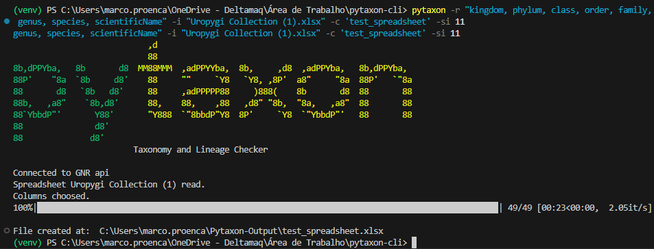
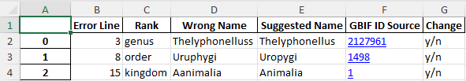
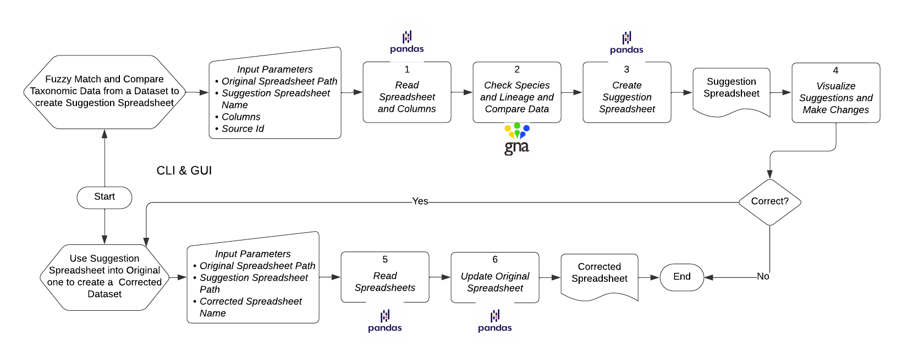

<p align="center"></p>

# Pytaxon: A Python software package for the identification and correction of errors in the taxonomic data of biodiversity species

Pytaxon is a Python-based tool designed to correct taxonomic name errors in large biodiversity databases, preventing inaccurate data from affecting ecological analyses and conservation efforts. By leveraging the Global Names Resolver (GNR) API and fuzzy matching techniques, Pytaxon identifies and suggests corrections for discrepancies and nomenclatural inconsistencies in spreadsheets. The tool provides both a Command Line Interface (CLI) and a Graphical User Interface (GUI), making it accessible to users with varying levels of computational expertise. Pytaxon thus enhances the accuracy of biodiversity data, supporting informed conservation decisions and robust scientific research.

<br>

## Installation Guide
### Dependencies
* Listed at requirements.txt

Install the package from [PyPI](https://pypi.org/project/pytaxon/):
```
$ pip install pytaxon
```
To download the Pytaxon GUI .exe: 

|      | win                                                          | lin                                                          |
| ---- | ------------------------------------------------------------ | ------------------------------------------------------------ |
| .zip | [Link](https://drive.google.com/file/d/1iBMTVAKbo_06jj6vAG30D01a-HThPzgc/view?usp=drive_link) | [Link](https://drive.google.com/file/d/1m-Jh1CIADKo0OAKUkFiMzj3cehlyShz5/view?usp=drive_link) |
| .rar | [Link](https://drive.google.com/file/d/1eTyPHLXGj11VH8MC0MMY8L8UH3aOcT16/view?usp=drive_link) | [Link](https://drive.google.com/file/d/1U1CxFBCMslfHMCgo52uZPVlwAShceqjh/view?usp=drive_link) |

<br>

## Workflow
Firstly, you will want to check your spreadsheet for errors, then the program will return you and Excel file (.xlsx) containing all the incorrect data depending on the selected data source.

Then, you may select which data are to be corrected with the "Change" column, after this, you may run the  second command to correct automatically the original spreadsheet with the checked spreadsheet.

```
$ pytaxon -r <column names> -i <path to original spreadsheet> -c <name of to check spreadsheet> -si <source id>

$ pytaxon -os <path to original spreadsheet> -cs <path of checked spreadsheet> -o <name of corrected spreadsheet>
```
Explore the options for these commands with the `--help` flag.

<br>

## Illustrative Examples

<p align="center"></p>

Pytaxon CLI running on the Visual Studio Code terminal (Powershell) with a modified version of the Uropygi dataset

<p align="center"></p>

The to correct spreadsheet of the modified Uropygi dataset

<p align="center"></p>

Pytaxon GUI application running with a modified version of the Uropygi dataset

<br>

## Citing

If you use the source code of Pytaxon in any form, please cite the following manuscript (we encorage citing Global Names Resolver as well):

_future manuscript_

<br>

## Acknowledgements

We thank the following institutions, which contributed to ensuring the success of our work:

Museu Paraense Emílio Goeldi (MPEG)

Centro Universitário do Estado do Pará (CESUPA)

<br>

## Funding

This research was supported  by Centro Universitário do Pará - CESUPA with the PIBICT scientific initiation scholarship project.

<br>

## Authors

Marco Aurélio Proença Neto

Marcos Paulo Alves de Sousa

<br>

## Contact

Dr. Marcos Paulo Alves de Sousa (Project leader)

_Email: **msousa@museu-goeldi.br**_

_Grupo de Estudos Temático em Computação Aplicada (GET-COM)_

_Centro Universitário do Pará - CESUPA_

_Av. Perimetral 1901. CEP 66077- 530. Belém, Pará, Brazil._
